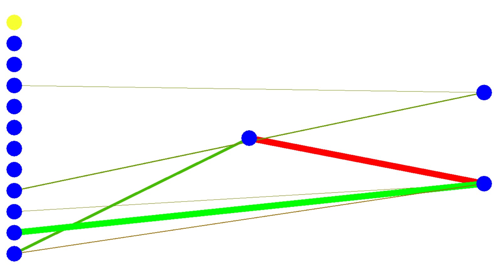

# Racecar-NEAT

This project uses NEAT to train a neural network to control a race car. The race car is put inside a virtual 2d circuit environment, in which it will have to drive around the track. The track is defined by the track limits (a set of lines defining the outer edges of the circuit) and the 'checkpoints' which sit at the end of each track sector. These checkpoints are used to track the progress of an agent around the track, and to update its fitness.

The agent measures distances towards the track limits, keeps track of its speed and drifting speed and the direction towards the next checkpoint. These are the inputs of a neural network, which will transform these inputs into a two outputs: a steering and throttle action. These actions are used in the vehicle model to move the car.

Hitting a track limit means immediate elimination of the agent and a penalty of -100 fitness. Each time-step, an agent loses 1 fitness to promote faster moving agents. Hitting a checkpoint adds 100 to the fitness. There is a time limit for the simulation in each generation.


## Usage
NOTE: this project was not made to be distributed for public use, and usage might be a bit obscure/non-user-friendly. For example, many parameters are hard-coded in config files or in the code itself; they can be changed, you just need to know where and how. If you need help with running this, please contact me directly on GitHub and I will try to assist you.

### Main evolution
Running the program is very simple. Only the file `main.py` has to be run, it will then load all of the necessary files. In the default setup, the evolution is ran with 40 genomes for 50 generations on the obstacle run environment. To change the environment, the following line of code in `./main.py` (line 16) should be changed:
```Python
with open("./racegame/tracks/Obstaclerun/obstacle_run.json", 'r') as f:
```
Here, the path used in the `open` statement should be changed to that of another track. Note that this should be a json file of the correct format. The tracks that are available by default in the ./racegame/tracks folder all have the required files in their respective folders (so a track image and a `json` file containing the track data). For example, to run the Silverstone track:
```Python
with open("./racegame/tracks/Silverstone/silverstone.json", 'r') as f:
```
The code will then find the corresponding track image by itself. To change the population size and max number of generations, the following line of code in `./main.py` (line 24) should be adjusted:
```Python
self.game = Game(40, 50, ....)
```
The first number (40) is the population size, the second number (50) the maximum number of generations. Note that increasing the population size will lead to better results, BUT will make the program run slower due to there being more agents to simulate.

Injecting a genome into an evolution happens in the `./game.py` file. On line 27, a Pickle file of a previously evolved network is loaded. This network will then be injected into the evolution. The folder `./results` contains a large amount of previously evolved networks. Any finished evolution will deposit its best performing genome into that folder; they are named according to when the program was run. Importing a genome from one of the baseline Silverstone runs can be done by changing line 27 to be the following:
```Python
initial_genome_file = open('./Results/silverstone-base-run-1, 'rb')
```
Please note that this is just for loading the genome. Another line has to be changed to ensure the genome is actually injected into the evolution. On line 32, the NEAT instance is created. Here, at the end of the class input, there is a parameter `inject_genomes = None`. This should be changed to be a list of genomes to be injected. In the default setup, only a single genome is loaded using Pickle, so we can only fill it with one genome as follows: `inject_genomes = [initial_genome]`. More genomes can of course be loaded and added to the list.

By default, all statistics are printed to console. Furthermore, statistics are saved to files in `./NEAT_RUN_STATS/` as `json` files and graphs are shown on screen after the run. To disable statistics printing to console after each generation, add `verbose = False` to the Population class input in `./game.py`. To disable statistics saving, provide `save_stats = False` and to disable the graphs appearing at the end of the evolution provide `do_graph = False`.

All parameters for the NEAT setup can be found and adjusted in the `./NEAT/config.py` file. Here, the parameters for variation/mutation are defined, as well as any other NEAT-specific parameters. Parameters for the visualisation window are found in `./racegame/config.py`, though it is advised not to change those. To enable FSNEAT or FDNEAT, the `./NEAT/genome.py` has to be adjusted. On lines 28 and 29, the boolean variables enabling FSNEAT and FDNEAT can be toggled. It is advised to only use one method at a time.

### Track generation
You can make your own tracks using the `./track_generator.py` script. Again, I shall repeat that it is not very user friendly (I made it for myself), but it does function fairly well. You need a 1280x720 pixel image map of a circuit to serve as a template. Use websites like [iloveimg](https://www.iloveimg.com/resize-image) to resize a differently sized image to the right size. To set up the track generator, first the track name has to be provided in line 29 of `./track_generator.py`:
```python
self.track_name     = "obstacle_run"    # Name of track (CHANGE WHEN MAKING NEW TRACK)
```
Then, the correct background template has to be selected. This is done in line 28 of `./track_generator.py`. You have to provide a valid path to an image file. It is easiest to create a new directory for your track in `./racegame/tracks`, and put it inside of there. Then put the correct path to your image inside that newly created directory in the Pyglet image load call:
```Python
self.pic            = pyglet.image.load('./racegame/tracks/YOURTRACK/YOURTEMPLATE.jpg')
```
Then, you can run the script `./track_generator.py`. This will bring up a screen, with your template as background. Now, you can start by defining the track limits. These are straight lines, end-to-end. By clicking, you set a new endpoint to a line (or create a start point if you have not created a line yet). This way, each time you click, you create a new track limit line. You can trace the outer edge of the circuit for example, till you reach back to the starting point. Now, to discontinue your line and start on the inner loop of track limits, click the right mouse button. This will reset the anchor point so you can start a new sequence of end-to-end lines. The mouse cursor will snap to previously defined line start and end points. 

To proceed to setting the checkpoints (lines for the agent to cross to increase their fitness), press `enter`. This will enable the reward sector placement state of the script. To create these checkpoint lines, press once somewhere to create an anchor point and press somewhere else to place the end point. This will create a single checkpoint line. My advise is to create the checkpoint lines between start- or end-points of the track limit lines (e.g. by snapping your cursor to those points. Makes it easier to place lines that span the width of the track entirely). It is **very important** to place the checkpoints *in order*! This means starting from just ahead of the start/finish line, going along the track and placing checkpoints after one another in order. This is because the order in which the checkpoints are created is the order in which the agent will have to pass them to obtain their fitness reward. Placing them in the wrong order can cause the agent not to get any reward when crossing a checkpoint, causing the evolution process to stall.

**Tip**: For both the track limit and checkpoint placement processes, you can use `backspace` to undo your last placed line. This can be done for the full history of placed lines, so you can undo some if you placed them incorrectly.

**Tip**: Place the checkpoints about five to ten vehicle lengths apart.

When you are done placing checkpoints, press `enter` to save the data to a `.json` file. This file will be placed in the `./` (main) directory, named `TRACKNAME.json`. Now, press `rshift` (right shift on the keyboard) to create a track image. This will be an image with a black background and blue lines for the track limits. This image will work fine (as it is only for visualisation purposes, not for actual functioning of the simulation), but you can adjust it using software like Paint. Now, the `.json` file and the track image file should be placed in the same directory (preferably the track directory you created earlier). To finalise the setup, you need to change some setup parameters at the end of the `.json` file. This is about the following section:
```Python
  "bg_name": "YOURBGNAME.png",
  "start_pos": {
    "x": STARTPOS_X,
    "y": STARTPOS_Y,
    "heading": STARTHEADING
  }
```
Here, `"bg_name"` should be set to the filename of the generated background image (in the same directory as the `.json` file!). `"STARTPOS_X"` and `"STARTPOS_Y"` should be set to the pixel values of the desired start position of the agents. Note that the `x` value is one on the left side of the screen, and the `y` value is **one on the bottom of the screen**, not the top! You can use programs like Paint to figure out the desired pixel location of the start. The start heading is the rotation in which the agents should start. A heading of zero points towards the right side of the screen, the positive direction is turning left. So: to face to the left, a start heading of 180 has to be set. Now, to use the track, check the "Main evolution" section of this README.
## Requirements
This implementation needs the following modules:
- Numpy
- Pygame
- Pyglet
- Matplotlib
## Results
The results of a typical evolution on the Silverstone environment are shown in the figure below. Several notable events have been indicated in the top graph. The top graph shows the fitness of the best genome in the population for each generation. The second graph shows the fitness of the best genome of each species separately. The bottom graph shows the distribution of genomes over different species (coloured in different shades).


The mean over three runs and the corresponding standard deviation above and below are shown in the figure below.


A typical genome created by 'standard' NEAT is shown below.


Another version of NEAT, FSNEAT (or Feature Select NEAT), produces simpler networks. Evolution of fitness of FSNEAT on the Silverstone environment and a typically evolved genome are shown in the figures below.




Another version of NEAT, FDNEAT (or Feature Deselect NEAT), produces simpler networks. Evolution of fitness of FDNEAT on the Silverstone environment  and a typically evolved genome are shown in the figures below.


## Screenshots
The window shown during evolution:


Creating track limits with Silverstone as a template:


Placing checkpoints (green lines) on the track


## Future work
There still is a lot that can be added / adjusted in this project. I would suggest:
- Changing the car dynamics (car model) to be more realistic. Results could then perhaps be applicable to real-life, and the behaviour of the algorithm on different car models can then be investigated.
- Trying different versions of NEAT, like HyperNEAT or NoveltyNEAT
- During training, use a different environment (track) each generation. By doing so, networks are evolved that are good at riding around any general track layout, rather than being optimized for a single track only (overfitting on the single training environment, if you will). Each generation, run the agents on a randomly chosen track. In the end, test (validate) on a completely different track that was not used during training.
## Acknowledgements
I would like to acknowledge the following sources which I have used during the development of this project:
 - [Car model used](https://github.com/Code-Bullet/Car-QLearning/blob/master/Game.py)
 - [NEAT code inspiration #1](https://github.com/mvoelk/neat.git)
 - [NEAT code inspiration #2](https://github.com/CodeReclaimers/neat-python.git)
 - [Original NEAT paper](https://nn.cs.utexas.edu/downloads/papers/stanley.ec02.pdf)


## Accompanying Work
I have written a paper accompanying this project, in which I discuss the setup of the project and the results I obtained. This paper can be found [here](https://google.com)